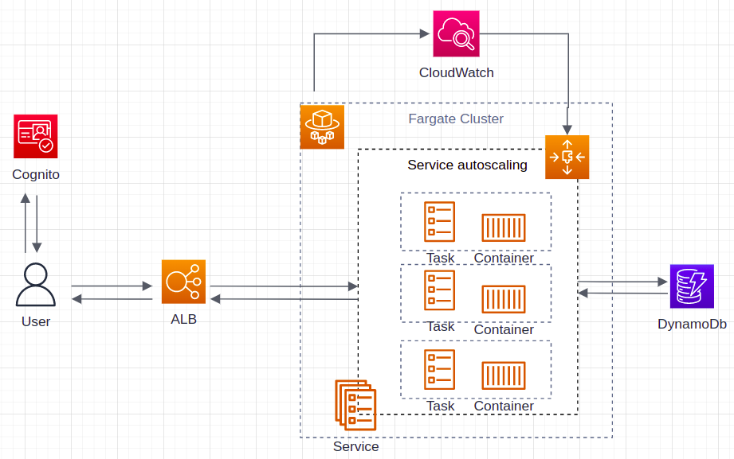

<h1>Architecture</h1>

By carefully utilizing AWS services, Expense Logger is designed to be a highly available, scalable and secure API service:

- Every endpoint is secured with JWT tokens - AWS Cognito.
- User data is stored in the database layer with AWS DynamoDB.
- The conterized applicaiton is constructed and powered by AWS ECR and ECS (Fargate).
- The high availability is guaranteed by AWS ECS Service.
- The scalability is supported by AWS Application autoscaling.
- The whole infrastructure is constructed with Cloudformation.

In addition to that, the API back-end and the CLI client are constructed with Flask, boto3 with customizations.